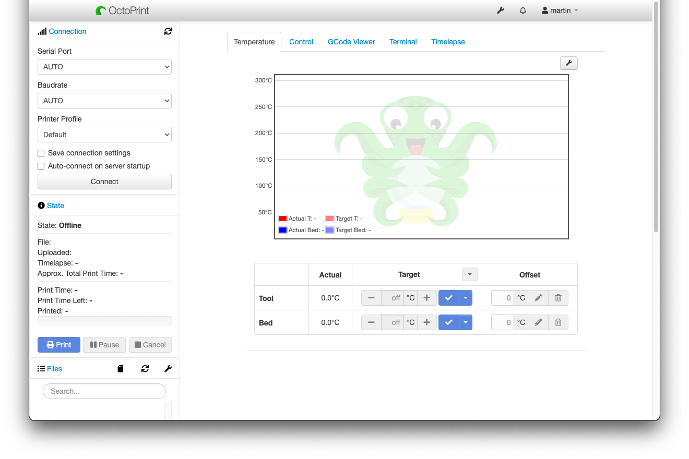

# OctoPrint-ModernUI

My personal take on a Modern UI for OctoPrint.

Uses flexbox to control the layout instead of relying on fixed pixels which allows a more responsive UI.

## Todo

- [ ] Mobile responsiveness
- [ ] Add generic flex to default classnames used in the UI already
- [ ] Update designs of elements to look more modern I.e. Latest bootstrap/material designs

## Setup

Install via the bundled [Plugin Manager](https://docs.octoprint.org/en/master/bundledplugins/pluginmanager.html)
or manually using this URL:

    https://github.com/martinwheeler/OctoPrint-ModernUI/archive/master.zip
